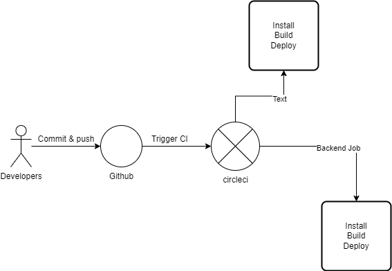

## Udagram Pipeline

### Continuous Integration
#### GitHub
The github is used to store the code base application. Whenever the developer commit & push new changes to that. It will automatically trigger the pipeline

#### CircleCI
CI/CD service is triggered from the github commit & push action. Its store the envrionment variables and bundle of steps need to install/build/deploy/start the application

There are 3 jobs to be run by CircleCI.
- **build**: Run the install and build script for both front-end and back-end. It will check every errors while building application
- **hold**: Wait for the user to approve that manually
- **deploy**: Run the install, build and deploy script for both front-end and back-end
